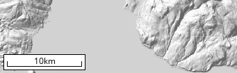
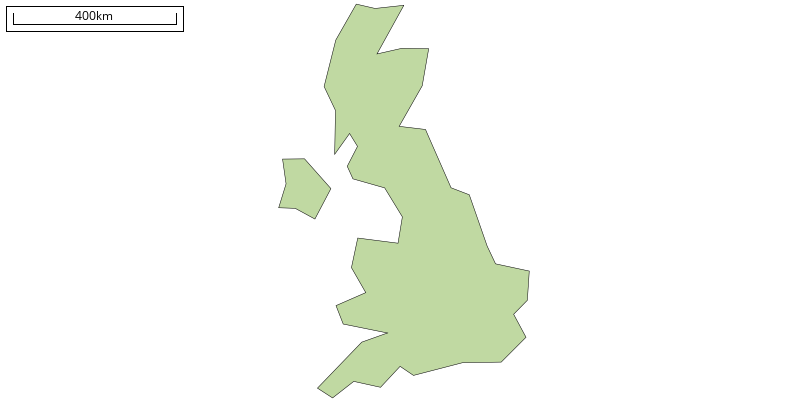
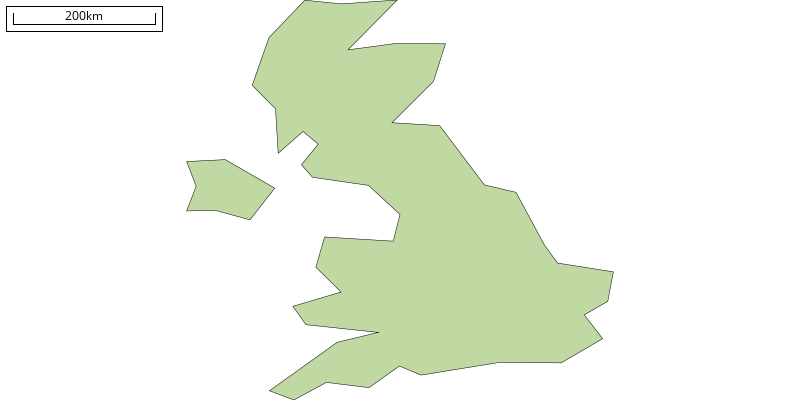

# mapnik-scalebar
A quick and dirty PIL-based scale bar generator for Mapnik maps



## Dependencies

* [Mapnik](http://mapnik.org/) Python bindings
* PIL / [Pillow](https://python-pillow.org/)
* [PyProj](https://jswhit.github.io/pyproj/)

## Usage

This script is designed to provide a simple way to add a 'quick and dirty' scale bar to a Mapnik map using PIL. It works out how long it wants to be based upon the size of the map, and draws itself to that size. Simple!

Usage is as simple as:

```python
import scalebar

# make a mapnik map
m = mapnik.Map(600, 600)

...

# render mapnik map to file
mapnik.render_to_file(m, 'map.png', 'png')

# open rendered map for editing
im = Image.open('images/wgs84.png')

# add scalebar
sb = scalebar.getScaleBar(m)
im.paste(sb, (5, 5))

# save output
im.save('images/wgs84.png', "png")
```

This function does nothing fancy, you can't tell it how long you want the scalebar to be, what colour or what units. It is purely intended as a cheap and nasty approach, though if you want more control it should be relatively simple to modify the code.

More detailed usage is given in [test.py](test.py)

## Projection

`scalebar` can be used with a projected CRS, or with a geographic one (though this is not generally good practice). If you do wish to do the latter, `scalebar` handles this by calculating the length of a degree at the centre of the map using a simple equirectangular projection (the same as mapnik will use to draw the map), and using this to calculate the length of the scalebar.

To facilitate this you can, if you wish, add the radius of the sphere from which you are working using th `R` argument (if you do not provide one, it assumes `6371008.771415`m - the value for WGS84):

```python
sb = scalebar.getScaleBar(m, R=6371008.771415)
```

Here is an example of a projected map of the United Kindom with a Scalebar:



And the same map using a 'default' equirectangular projection:



## DPI

`scalebar` bases some of its cosmetic measurements on a conversion from mm to px, and uses a default value of `90.7`dpi, which is based upon the OGC definition of a pixel. If you would like to print to a particular resolution, you can edit this using the `dpi` argument:

```python
sb = scalebar.getScaleBar(m, dpi=90.7)
```

## Acknowledgements
### The Open-Sans Font
For convenience, the [Open-Sans](https://fonts.google.com/specimen/Open+Sans) font has been bundled with this software. This is available under the [Apache 2.0](http://www.apache.org/licenses/LICENSE-2.0) license. This copy was obtained from [Google Fonts](https://fonts.google.com/specimen/Open+Sans).

### Natural Earth Data
The dataset included for use with the [test.py](test.py) file is derived from the freely available dataset at [Natural Earth](http://www.naturalearthdata.com/downloads/). These dataset have been released into the [public domain](http://www.naturalearthdata.com/about/terms-of-use/).